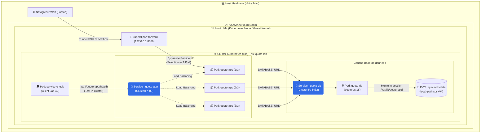

# Architecture Notes - Lab 52

## 1. Diagramme d'architecture

```mermaid
flowchart TB
subgraph Host ["💻 Host Hardware (Votre Mac)"]
Browser["🌐 Navigateur Web (Laptop)"]

        subgraph Hypervisor ["⚙️ Hyperviseur (OrbStack)"]

            subgraph VM ["🐧 Ubuntu VM (Kubernetes Node / Guest Kernel)"]
                PortForward["🔄 kubectl port-forward (127.0.0.1:8080)"]

                subgraph Cluster ["☸️ Cluster Kubernetes (k3s) - ns: quote-lab"]

                    subgraph AppLayer ["Couche Application"]
                        AppSvc("🔀 Service : quote-app\n(ClusterIP: 80)")
                        AppPod1["📦 Pod: quote-app (1/3)"]
                        AppPod2["📦 Pod: quote-app (2/3)"]
                        AppPod3["📦 Pod: quote-app (3/3)"]
                    end

                    subgraph DBLayer ["Couche Base de données"]
                        DBSvc("🔀 Service : quote-db\n(ClusterIP: 5432)")
                        DBPod["🗄️ Pod: quote-db\n(postgres:18)"]
                        PVC[("💾 PVC : quote-db-data\n(local-path sur VM)")]
                    end

                    TestClient["🕵️ Pod: service-check\n(Client Lab 42)"]
                end
            end
        end
    end

    %% Chemins de trafic (Traffic paths)
    Browser -- "Tunnel SSH / Localhost" --> PortForward
    PortForward -- "Bypass le Service\n(Sélectionne 1 Pod)" --> AppPod1

    TestClient -- "http://quote-app/health\n(Test in-cluster)" --> AppSvc
    AppSvc -. "Load Balancing" .-> AppPod1
    AppSvc -. "Load Balancing" .-> AppPod2
    AppSvc -. "Load Balancing" .-> AppPod3

    AppPod1 -- "DATABASE_URL" --> DBSvc
    AppPod2 -- "DATABASE_URL" --> DBSvc
    AppPod3 -- "DATABASE_URL" --> DBSvc

    DBSvc --> DBPod
    DBPod -- "Monte le dossier /var/lib/postgresql" --> PVC

    classDef k8s fill:#326ce5,stroke:#fff,stroke-width:2px,color:#fff;
    class AppSvc,DBSvc k8s;
```
